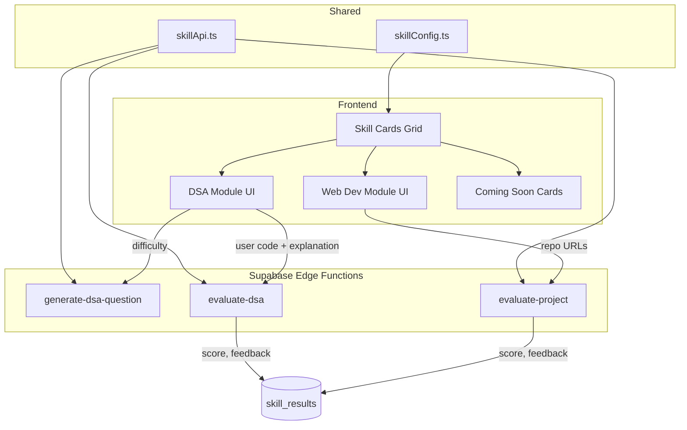

# Modular Skill Verification System

Build a modular, extensible skill verification system with DSA & Web Dev modules, Supabase Edge Functions for AI evaluation, and a clean skill-card UI in the student dashboard.

## User Review Required

> [!IMPORTANT]
> **Supabase Edge Functions** require the Supabase CLI and a linked project. Do you already have the Supabase CLI installed and your project linked (`supabase link`)? If not, I'll include setup instructions.

> [!IMPORTANT]
> **Gemini API Key for Edge Functions**: Edge Functions run server-side and need `GEMINI_API_KEY` as a Supabase secret (not the `VITE_` prefixed one). I'll use `supabase secrets set GEMINI_API_KEY=<your-key>` during deployment. Confirm this is acceptable.

> [!IMPORTANT]
> **GitHub API for Web Dev module**: Fetching repo data from GitHub's public API is rate-limited (60 req/hr unauthenticated). For hackathon purposes this is fine, but if you have a GitHub PAT, it can be added as a Supabase secret for higher limits.

## Open Questions

> [!IMPORTANT]
> **Monolithic App.tsx**: Your entire app (1377 lines) lives in a single `App.tsx`. This plan will extract skill-related components into separate files under `src/components/` and `src/lib/` to keep things manageable. The existing UI structure (dashboard layout, sidebar, etc.) will **not** be redesigned — only the "Add Skills" tab content will be replaced with the new skill card system. Does this approach work?

> [!NOTE]
> **Database migration**: The existing `skill_results` table already has the right schema (`skill_type`, `score`, `confidence`, `feedback`, `raw_data`). The only change needed is relaxing the `skill_type` check constraint to allow future skill types beyond `'dsa', 'webdev', 'sql'`. I'll provide this as a SQL migration.

---

## Proposed Changes

### Architecture Overview



---

### Component 1: Skill Configuration

Central config that drives the entire system. Adding a new skill = adding one object here.

#### [NEW] [skillConfig.ts](file:///c:/Users/asus/Downloads/employability-verification-platform/src/lib/skillConfig.ts)

Defines the `SkillConfig` type and exports the `SKILLS` array:

```ts
export interface SkillConfig {
  id: string;            // e.g. "dsa", "webdev"
  name: string;          // Display name
  description: string;
  icon: string;          // Lucide icon name
  status: "active" | "coming_soon";
  color: string;         // Tailwind color class
}

export const SKILLS: SkillConfig[] = [
  { id: "dsa",    name: "DSA",       status: "active",      ... },
  { id: "webdev", name: "Web Dev",   status: "active",      ... },
  { id: "sql",    name: "SQL",       status: "coming_soon", ... },
  { id: "ml",     name: "ML",        status: "coming_soon", ... },
  { id: "devops", name: "DevOps",    status: "coming_soon", ... },
];
```

---

### Component 2: Skill API Client

#### [NEW] [skillApi.ts](file:///c:/Users/asus/Downloads/employability-verification-platform/src/lib/skillApi.ts)

Generic client that calls Edge Functions via `supabase.functions.invoke()`:

- `generateDSAQuestion(difficulty)` → calls `generate-dsa-question`
- `evaluateDSA(payload)` → calls `evaluate-dsa`
- `evaluateProject(payload)` → calls `evaluate-project`
- `evaluateSkill(skillType, payload)` → generic router that dispatches to the correct function
- `saveSkillResult(result)` → inserts into `skill_results` table

---

### Component 3: Supabase Edge Functions

#### [NEW] supabase/functions/generate-dsa-question/index.ts

- Receives `{ difficulty }` in request body
- Uses Gemini API to generate a DSA question (reusing prompt logic from existing `gemini.ts`)
- Returns structured `DSAQuestion` JSON

#### [NEW] supabase/functions/evaluate-dsa/index.ts

- Receives `{ question, userCode, userExplanation }` in request body
- Uses Gemini API to evaluate the submission
- Returns structured `DSAEvaluation` JSON

#### [NEW] supabase/functions/evaluate-project/index.ts

- Receives `{ repos: [{ url, readme, description, languages }] }` in request body
- Uses Gemini API to evaluate the projects holistically
- Returns `{ score, confidence, feedback, skill_dna, strengths, improvements }`

Each function follows the same pattern:
```
1. Parse request body
2. Validate input
3. Build Gemini prompt
4. Call Gemini API
5. Parse + return JSON response
```

#### [NEW] supabase/functions/_shared/gemini.ts

Shared Gemini helper used by all Edge Functions (DRY). Contains the `callGemini<T>()` helper.

---

### Component 4: Frontend Components

#### [NEW] [SkillCards.tsx](file:///c:/Users/asus/Downloads/employability-verification-platform/src/components/SkillCards.tsx)

Grid of skill cards driven by `SKILLS` config:
- Active skills show a "Start Verification" button
- Coming soon skills show a disabled state with a lock/clock icon
- Each card shows: icon, name, description, status badge
- Clicking an active card opens the corresponding module

#### [NEW] [DSAModule.tsx](file:///c:/Users/asus/Downloads/employability-verification-platform/src/components/DSAModule.tsx)

Full DSA verification flow (extracted from existing `SkillVerification` component logic):
1. **Difficulty selection** → calls `generate-dsa-question` Edge Function
2. **Question display** → shows problem, examples, constraints
3. **Code editor + explanation** → user writes solution
4. **Submit** → calls `evaluate-dsa` Edge Function
5. **Results** → shows score breakdown, feedback, strengths/improvements
6. **Save** → stores result in `skill_results` table

#### [NEW] [WebDevModule.tsx](file:///c:/Users/asus/Downloads/employability-verification-platform/src/components/WebDevModule.tsx)

Web Dev verification flow:
1. **Repo input** → up to 4 GitHub URLs
2. **Fetch metadata** → calls GitHub API for README, description, languages
3. **Submit** → calls `evaluate-project` Edge Function with fetched data
4. **Results** → shows score, feedback, project-level breakdown
5. **Save** → stores result in `skill_results` table

#### [NEW] [SkillResults.tsx](file:///c:/Users/asus/Downloads/employability-verification-platform/src/components/SkillResults.tsx)

Reusable results display component used by both DSA and Web Dev modules.

---

### Component 5: Dashboard Integration

#### [MODIFY] [App.tsx](file:///c:/Users/asus/Downloads/employability-verification-platform/src/App.tsx)

Minimal changes:
- Import new components
- Replace the "Add Skills" tab content (currently the hardcoded `SkillVerification` component) with the new `SkillCards` component
- Wire up navigation between skill cards → individual modules → back to cards
- Update the "Verified Expertise" section on the dashboard to pull real data from `skill_results`

The old `SkillVerification` component (lines 473-724) will be removed and replaced.

---

### Component 6: Database Migration

#### [NEW] [002_extend_skill_results.sql](file:///c:/Users/asus/Downloads/employability-verification-platform/supabase_migrations/002_extend_skill_results.sql)

```sql
-- Remove the restrictive check constraint so new skill types can be added
ALTER TABLE public.skill_results 
  DROP CONSTRAINT IF EXISTS skill_results_skill_type_check;

-- Add a more flexible constraint (or no constraint at all)
ALTER TABLE public.skill_results 
  ADD CONSTRAINT skill_results_skill_type_check 
  CHECK (skill_type ~ '^[a-z_]+$');

-- Add skill_dna column if not already present
-- (it already exists in the schema, so this is a safety check)
```

---

## File Summary

| File | Type | Purpose |
|------|------|---------|
| `src/lib/skillConfig.ts` | NEW | Skill definitions (add new skills here) |
| `src/lib/skillApi.ts` | NEW | Edge Function client + generic `evaluateSkill()` |
| `src/components/SkillCards.tsx` | NEW | Skill selection grid UI |
| `src/components/DSAModule.tsx` | NEW | DSA question generation + evaluation flow |
| `src/components/WebDevModule.tsx` | NEW | GitHub repo evaluation flow |
| `src/components/SkillResults.tsx` | NEW | Reusable score/feedback display |
| `src/App.tsx` | MODIFY | Wire new components into dashboard |
| `supabase/functions/_shared/gemini.ts` | NEW | Shared Gemini helper for Edge Functions |
| `supabase/functions/generate-dsa-question/index.ts` | NEW | DSA question generation |
| `supabase/functions/evaluate-dsa/index.ts` | NEW | DSA solution evaluation |
| `supabase/functions/evaluate-project/index.ts` | NEW | Web Dev project evaluation |
| `supabase_migrations/002_extend_skill_results.sql` | NEW | Relax skill_type constraint |

---

## Verification Plan

### Automated Tests
- `npm run lint` — TypeScript compiles cleanly
- `npm run dev` — App loads without errors
- Manual browser test: navigate to dashboard → Add Skills → verify skill cards render
- Manual browser test: click DSA card → verify question generation flow
- Manual browser test: click Web Dev card → verify repo input flow

### Manual Verification
- Deploy Edge Functions via `supabase functions deploy`
- Test each Edge Function individually via `supabase functions invoke`
- End-to-end: complete a DSA verification → verify result appears in `skill_results` table
- End-to-end: submit GitHub repos → verify evaluation result is stored
